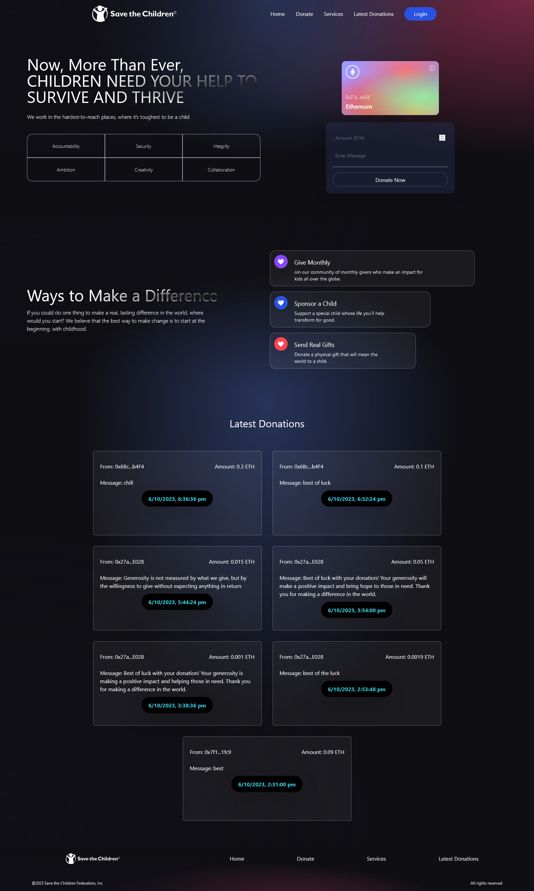

# DONATION Send Ethereum Web3

**donate Application**: You can donate Ethereum using this application.





## Smart Contract

- Solidity Version: `^0.8.0`
- Deployment Network: Sepolia test net
- Deployment Tool: Hardhat

## Client Application

- Built with React.js
- Styled with Tailwind CSS
- Ethereum Integration: `ethers` library version 5.5.1
 

## Getting Started

### Prerequisites

Before you begin, ensure you have the following installed:

- [Node.js](https://nodejs.org/)
- [npm](https://www.npmjs.com/) or [Yarn](https://yarnpkg.com/)

### Installation

1. Clone the repository:

   ```bash
   git clone https://github.com/ruhulamin1398/DONATION-send-ethereum-web3.git

# Contributing

If you'd like to contribute to this project, please follow these guidelines:

1. Fork the project on GitHub.
1. Create a new branch with a descriptive name for your feature or bug fix.
1. Make your changes and commit them with clear, concise commit messages.
1. Push your changes to your fork.
1. Create a pull request to the main branch of the original repository.


# License

This project is licensed under the MIT License - see the LICENSE file for details.

# Acknowledgments

Mention any external libraries, frameworks, or tools that you used or give credit to any contributors or resources that helped you during the development of this project.


<hr>


Feel free to customize this template to provide more specific details about your project. Good luck with your "DONATION Send Ethereum Web3" project!

Copy and paste this template into a new .md file in your GitHub repository, and then customize it with the specific details of your project.

